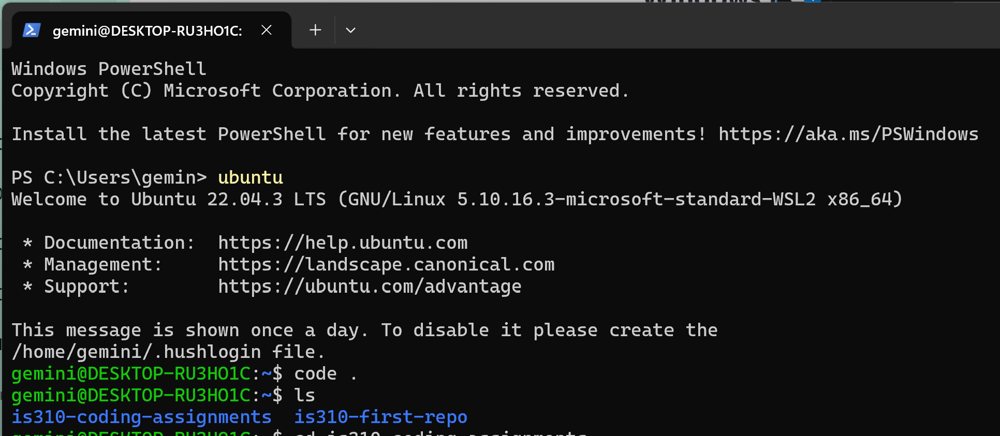
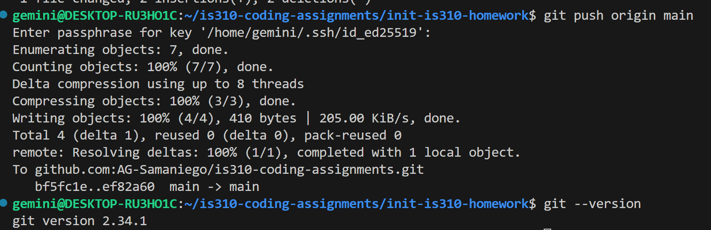
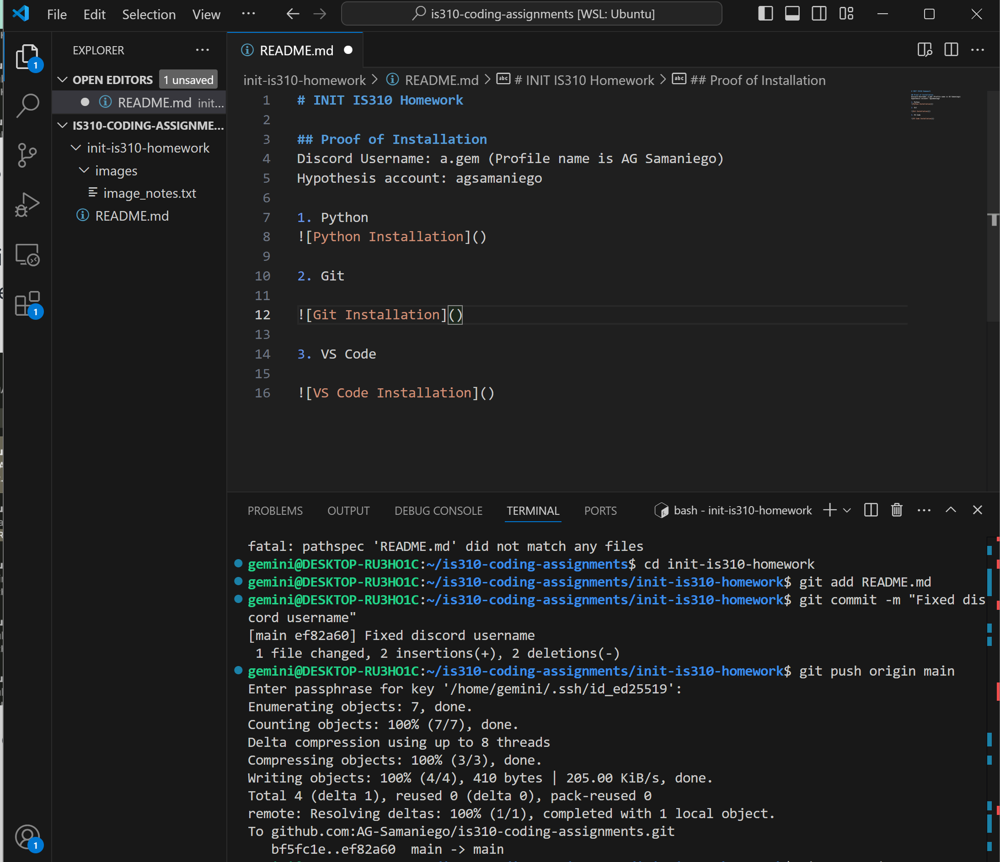

# INIT IS310 Homework

## Proof of Installation
Discord Username: a.gem (Profile name is AG Samaniego)
Hypothesis account: agsamaniego

1. Python

Note: I'm running on a Windows OS, so I just used a screenshot of me running Ubuntu

2. Git 

Bottom line has which version of Git I have installed!

3. VS Code
